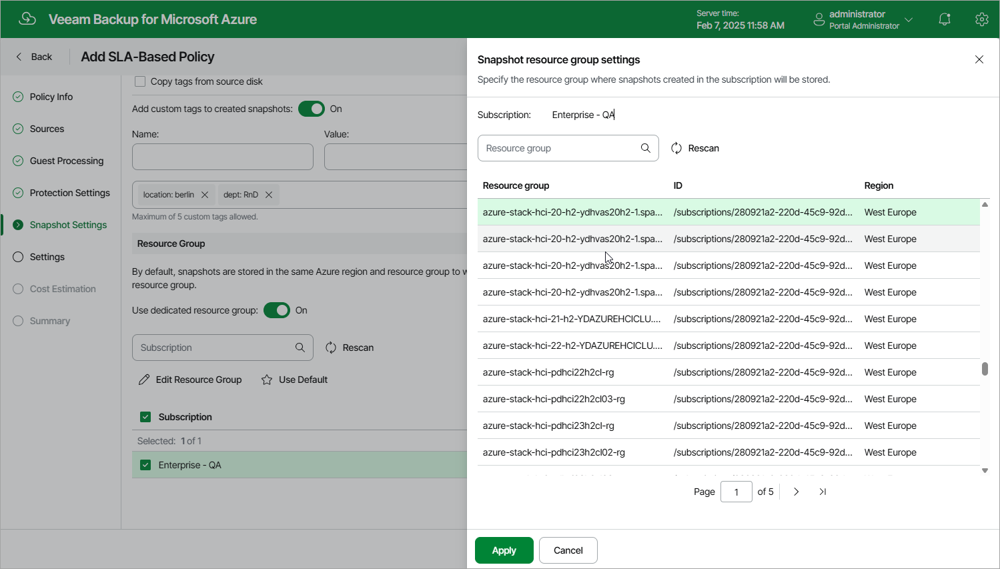

In this article

At the Snapshot Settings step of the wizard, you can enable tag assignment for cloud-native snapshots created by the policy and select a custom target location for the snapshots.

Tag Assignment

In the Tags section, you can choose whether you want to assign to snapshots of the selected Azure VMs already existing tags from source virtual disks and your own custom tags.

If you set the Add custom tags to created snapshots toggle to On, you must also specify the tags explicitly. To do that, use the Name and Value fields to specify a name and a value for the new custom tag, and then click Add. Note that you cannot add more than 5 custom tags.

|  |
| --- |
| Note |
| If you choose to copy tags from the source disks, Veeam Backup for Microsoft Azure will assign to cloud-native snapshots of the selected VMs not only the copied tags but also Azure tags with Veeam-specific metadata. If you choose to add custom tags, Veeam Backup for Microsoft Azure will assign the specified tags only. |

Snapshot Location Settings

By default, cloud-native snapshots of a processed VM are stored in the same Azure region and resource group to which the VM belongs. In the Resource Group section, you can choose to store snapshots in a different resource group. To do that, set the Use dedicated resource group toggle to On, select the subscription that manages the VM, click Edit Resource Group, choose the necessary resource group and click Apply.

For a subscription to be displayed in the list of available subscriptions, the service account specified at [step 3a](vm_sla_source_settings.md#account) must have access to this subscription. For a resource group to be displayed in the list of available groups, it must be [created in Microsoft Azure](https://learn.microsoft.com/en-us/azure/azure-resource-manager/management/manage-resource-groups-portal#create-resource-groups) and managed by the selected subscription.

Page updated 10/24/2025

Page content applies to build 8.0.1.202
