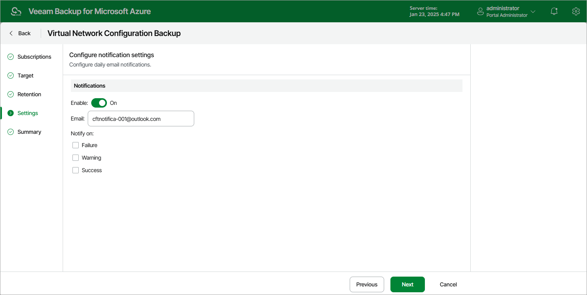

# Step 5. Specify Email Notification Settings

At the Settings step of the wizard, you can specify email notification settings for the Virtual Network Configuration Backup policy.

|  |
| --- |
| Note |
| To be able to specify email notification settings for the Virtual Network Configuration Backup policy, you must configure global notification settings first. For more information, see [Configuring Global Notification Settings](configuring_notification_settings.md). |

To instruct Veeam Backup for Microsoft Azure to send email notifications for the backup policy, do the following:

1. In the Notifications section, set the Receive daily report toggle to On.

If you set the toggle to Off, Veeam Backup for Microsoft Azure will not send any notifications for this backup policy — regardless of the configured [global notification settings](configuring_notification_settings.md).

1. In the Email field, specify an email address of a recipient. Use a semicolon to separate multiple recipient addresses.

1. Use the Notify on list to choose whether you want Veeam Backup for Microsoft Azure to send email notifications in case the backup policy completes successfully, completes with warnings or completes with errors.

|  |
| --- |
| Note |
| If you specify the same email recipient in both backup policy notification and [global notification settings](configuring_notification_settings.md), Veeam Backup for Microsoft Azure will override the configured global notification settings and will send each notification to this recipient only once to avoid notification duplicates. |

