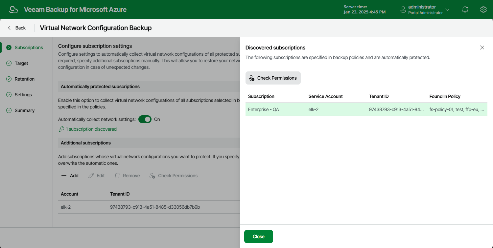

In this article

To instruct Veeam Backup for Microsoft Azure to protect the virtual network configuration of all Azure subscriptions specified in Azure VM, Azure SQL and Azure Files backup policy settings, in the Automatically protected subscriptions section, set the Automatically collect network settings toggle to On.

To retrieve virtual network configurations of all automatically protected Azure subscriptions, Veeam Backup for Microsoft Azure will use permissions of service accounts specified in the settings of backup policies that protect instances residing in these Azure subscriptions. It is recommended that you check whether service accounts whose permissions Azure VM, Azure SQL and Azure Files backup policies use to perform data protection operations have all the permissions required to perform Azure virtual network configuration backup. If the service account permissions are insufficient, the backup policy will fail.

To run the service account permission check:

1. In the Automatically protected subscriptions section, click the Discovered subscriptions link.
2. In the Discovered subscriptions window, select the service account whose permissions you want to check.
3. Click Check Permissions.

Veeam Backup for Microsoft Azure will display the Permission Check window where you can view the results of the performed check. If the service account permissions are insufficient, the check will complete with errors. You can view the list of permissions that must be granted to service accounts in the Details column. You can grant the missing permissions to service accounts as described in section [Checking Service Account Permissions](service_account_check.md).

Page updated 1/24/2025

Page content applies to build 8.0.1.202
