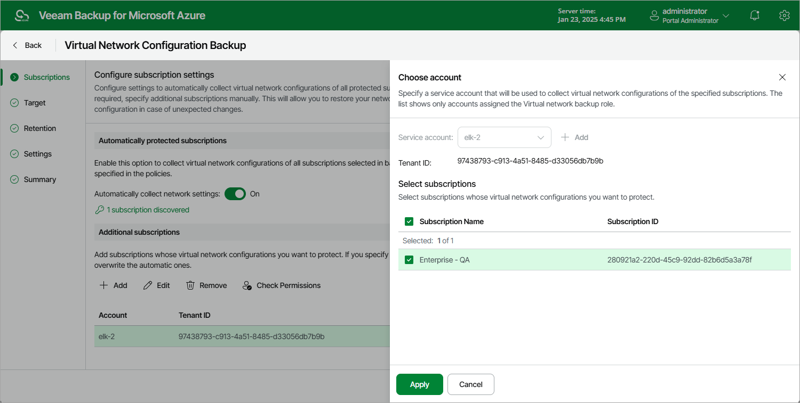

In this article

To add an Azure subscription to the Virtual Network Configuration Backup policy, or to choose another service account for collecting virtual network configuration data, do the following:

1. In the Additional subscriptions section, click Add.
2. In the Account settings window, from the Service account drop-down list, select a service account whose permissions Veeam Backup for Microsoft Azure will use to perform virtual network configuration backup. The specified service account must belong to the Microsoft Entra tenant associated with the subscription whose virtual network configuration you want to protect, and must be assigned permissions listed in section [Virtual Network Configuration Permissions](vnet_permissions.md#backup).

For a service account to be displayed in the list of available accounts, it must be added to Veeam Backup for Microsoft Azure and assigned the Virtual Network Backup operational role as described in section [Adding Service Accounts](service_account_add.md). If you have not added the necessary service account to Veeam Backup for Microsoft Azure beforehand, you can do it without closing the Virtual Network Configuration Backup wizard. To do that, click Add and complete the Add Account wizard.

1. In the Select subscriptions section, select the necessary Azure subscriptions from the list.

1. To save changes made to the backup policy settings, click Apply.
2. To check whether the service account specified for the selected Azure subscriptions has all the permissions required to perform Azure virtual network configuration backup, in the Additional subscriptions section, click Check Permissions.

You can add, edit or remove additional Azure subscriptions from the Virtual Network Configuration Backup policy.

Page updated 1/24/2025

Page content applies to build 8.0.1.202
