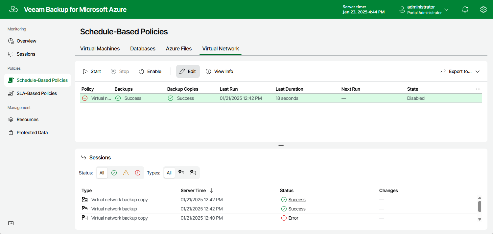

In this article

To launch the Virtual Network Configuration Backup wizard, do the following:

1. Navigate to Policies > Virtual Network.
2. Click Edit.

Page updated 3/13/2025

Page content applies to build 8.0.1.202
