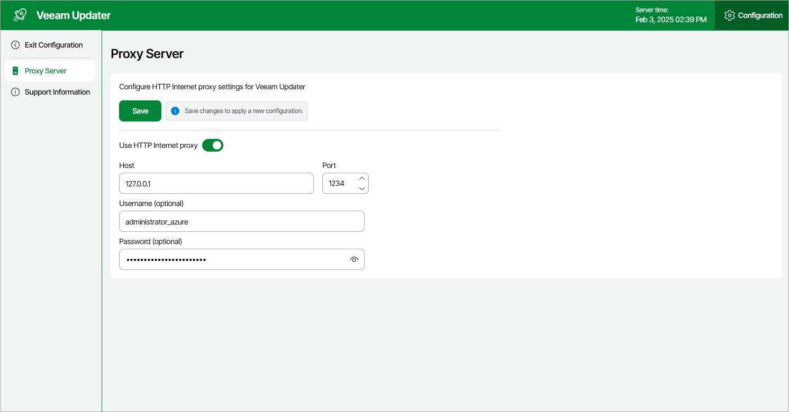

# Configuring HTTP Proxy for Veeam Updater

To check for available software package updates for Veeam Backup for Microsoft Azure, the Veeam Updater service running on the backup appliance connects to Veeam repositories over the internet. If the backup appliance is not connected to the internet, you can instruct Veeam Backup for Microsoft Azure to use an HTTP proxy that will allow Veeam Updater to access the required resources.

To establish connection of the Veeam Updater service to the internet through an HTTP proxy, do the following:

1. Open the Veeam Updater page:

1. Switch to the Configuration page.
2. Navigate to Support Information.
3. On the Updates tab, click Check and View Updates.

1. On the Veeam Updater page:

1. Switch to the Configuration page.
2. Navigate to Proxy Server.
3. Set the Use Internet proxy toggle to On.
4. In the Host field, enter the IP address or FQDN of the proxy.
5. In the Port field, enter the port used on the proxy for HTTP connections.
6. [Applies only if the HTTP proxy requires authentication] In the Username and Password fields, enter credentials of the user account configured on the proxy to access the internet.
7. Click Apply.

|  |
| --- |
| Important |
| * Veeam Backup for Microsoft Azure does not support access to resources through HTTPS proxy. * You cannot modify the HTTP proxy settings during checking for updates. |

