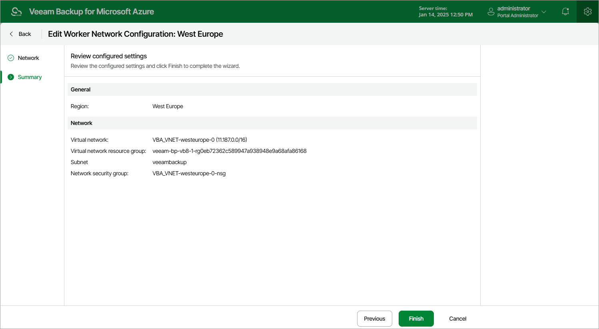

In this article

For each worker configuration, you can modify settings specified while adding the worker configuration to Veeam Backup for Microsoft Azure:

1. Switch to the Configuration page.
2. Navigate to Workers > Network.
3. Select the worker network configuration and click Edit.
4. Complete the Edit Worker Network Configuration wizard:

1. To choose another virtual network and subnet for the related worker instances, to change the security group associated with the specified subnet, and to choose whether you want Veeam Backup for Microsoft Azure to assign public IP addresses to worker instances used for file-level recovery operations, follow the instructions provided in section [Adding Worker Configurations](worker_configuration_network.md) (step 3).
2. At the Summary step of the wizard, review configuration information and click Finish to confirm the changes.

|  |
| --- |
| Note |
| If there are any worker instances created based on the selected configuration that are currently involved in a backup or restore process, the changes will be applied only when the process completes. |

Page updated 9/11/2025

Page content applies to build 8.0.1.202
