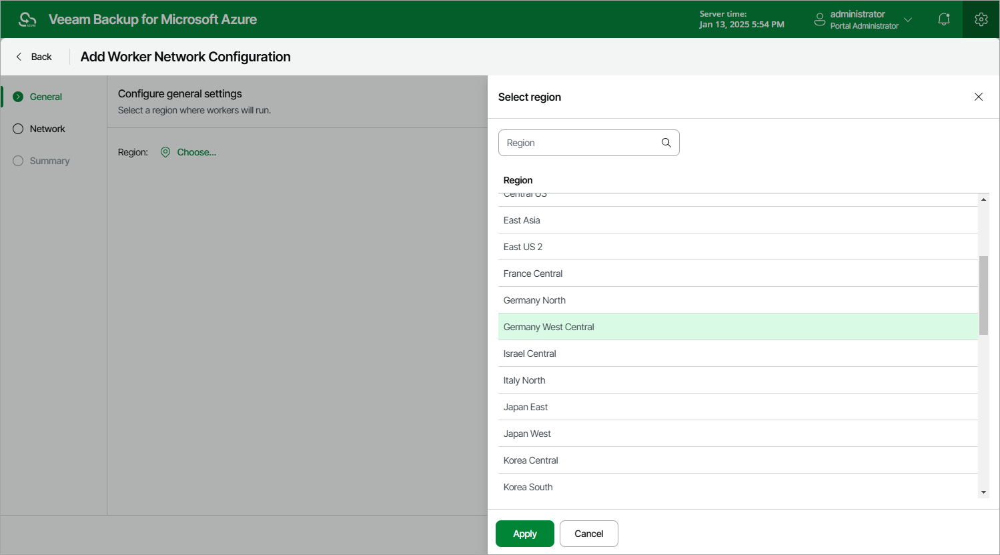

# Step 2. Specify General Settings

At the General step of the wizard, select an Azure region where new worker instances will operate. For more information on Azure regions in which Veeam Backup for Microsoft Azure launches worker instances to perform operations, see [Worker Instances](worker_instances.md).

