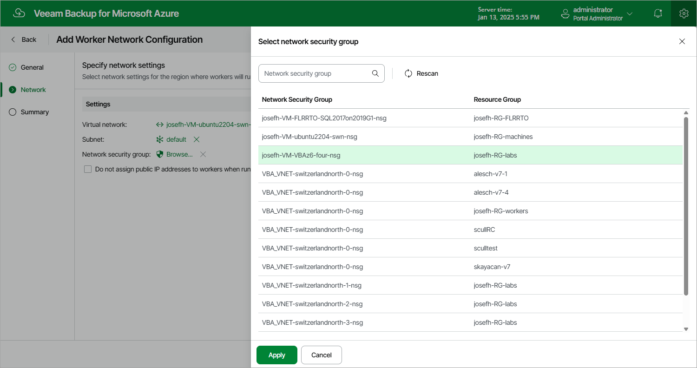

In this article

At the Network step of the wizard, do the following:

1. Select a virtual network and subnet to which you want to connect worker instances created based on the new worker configuration. You can either use an existing network or create a new one. For a network or subnet to be displayed in the list of available resources, it must belong to the subscription that is specified as the [destination for worker instances](worker_service_account.md).

To create a new network, click Add, and specify names and ranges of IP addresses for the new virtual network and the new subnet; to specify IP address ranges, use the CIDR (Classless Inter-Domain Routing) notation. For more information on managing networks in Microsoft Azure, see [Microsoft Docs](https://docs.microsoft.com/en-us/azure/virtual-network/manage-virtual-network).

|  |
| --- |
| Important |
| * The specified subnet address range must have at least one free IP address — Veeam Backup for Microsoft Azure will launch and simultaneously run as many worker instances as many free IP addresses there are in the subnet range.  * For virtual networks to which worker instances will be connected, virtual network service endpoints for the following services must be configured:  * Microsoft.Storage.Global — either configure an endpoint for this service manually in Microsoft Azure beforehand or let Veeam Backup for Microsoft Azure do it for you automatically while deploying the worker instances.  * Microsoft.Sql — manually configure an endpoint for this service if you plan to back up Azure SQL databases.  * Microsoft.AzureCosmosDB — manually configure an endpoint for this service if you plan to back up Cosmos DB for PostgreSQL accounts.   To learn how to configure virtual network service endpoints manually, see [Microsoft Docs](https://docs.microsoft.com/en-us/azure/virtual-network/virtual-network-service-endpoints-overview). |

1. Select a security group that will be associated with the specified subnet.

For a group to be displayed in the Network Security Group list, it must be created beforehand as described in [Microsoft Docs](https://docs.microsoft.com/en-us/azure/virtual-network/manage-network-security-group), and must belong to the subscription that is specified as the [destination for worker instances](worker_service_account.md).

|  |
| --- |
| Important |
| If you want worker instances created based on the new worker configuration to process resources that reside in private virtual networks, the selected security group must allow access to storage accounts created by Veeam Backup for Microsoft Azure. You can tell these resources from other Azure resources by the word veeam in their names and by the backup appliance ID in their tag values. |

1. Choose whether you want Veeam Backup for Microsoft Azure to assign public IP addresses to worker instances used for file-level recovery operations.

Page updated 10/24/2025

Page content applies to build 8.0.1.202
