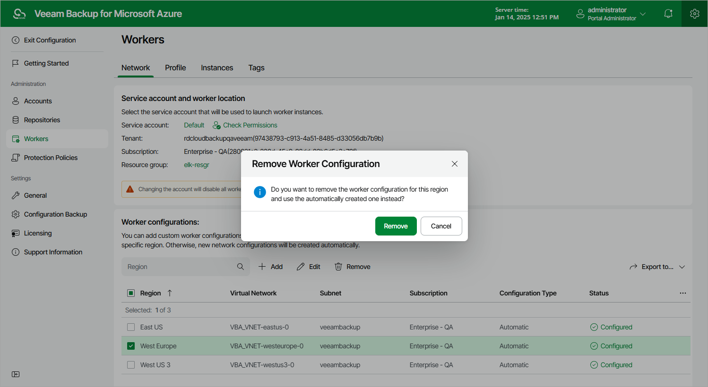

In this article

Veeam Backup for Microsoft Azure allows you to permanently remove worker configurations if you no longer need them. When you remove a worker configuration, Veeam Backup for Microsoft Azure does not remove currently running worker instances that have been created based on this configuration — these instances are removed only when the related operations complete.

To remove a worker configuration from Veeam Backup for Microsoft Azure, do the following:

1. Switch to the Configuration page.
2. Navigate to Workers > Network.
3. Select the worker network configuration and click Remove.

Page updated 4/30/2024

Page content applies to build 8.0.1.202
