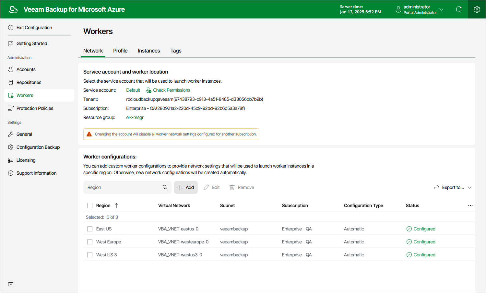

In this article

To launch the Add Worker Network Configuration wizard, do the following:

1. Switch to the Configuration page.
2. Navigate to Workers > Network.
3. In the Worker configurations section, click Add.

Page updated 10/24/2025

Page content applies to build 8.0.1.202
