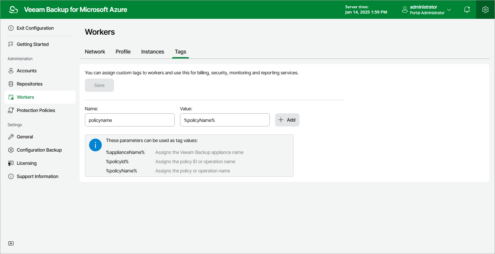

In this article

For all worker instances that are launched in specific Azure subscriptions for the duration of backup, restore and retention processes, you can assign custom Azure tags, which may help you differentiate worker instances that have the same or similar names:

1. Switch to the Configuration page.

1. Navigate to Workers > Tags.
2. Use the Name and Value fields to specify a key and a value for a new custom Azure tag, and then click Add. Note that you cannot add more than 50 custom Azure tags.

Consider the following limitations:

* The maximum length of the tag key is 128 characters.
* The maximum length of the tag value is 256 characters.
* The following characters are not supported: < > # % + & \ ? / .

For more information on tag limitations, see [Microsoft Docs](https://learn.microsoft.com/en-us/azure/azure-resource-manager/management/tag-resources#limitations).

1. Click Save.

|  |
| --- |
| Tip |
| You can use a number of runtime variables as tag values to allow Veeam Backup for Microsoft Azure to automatically fill in specific information for worker instances launched during data protection operations. However, for worker instances deployed during restore operations, retention tasks and configuration checks, the values of the %policyid% and %policyName% variables will be replaced with operation names. |

Page updated 5/30/2025

Page content applies to build 8.0.1.202
