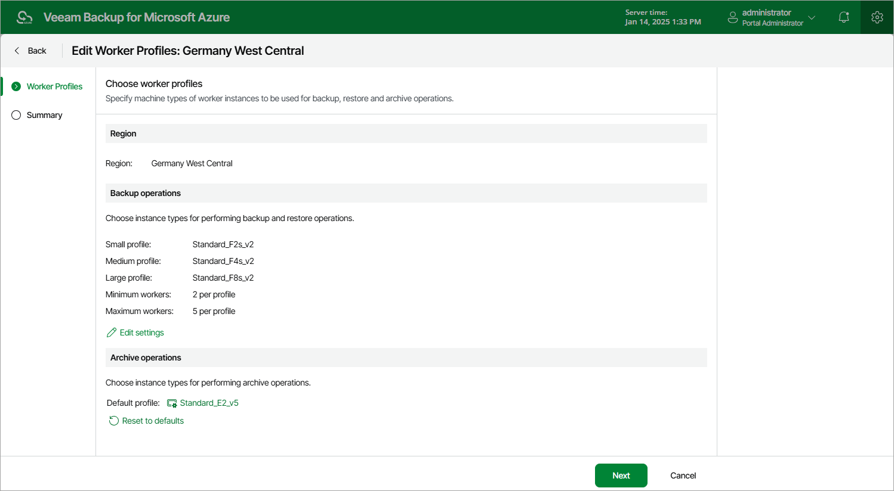

In this article

For each set of worker profiles created for an Azure region, you can modify settings specified while creating the profile set:

1. Switch to the Configuration page.
2. Navigate to Workers > Profile.
3. Select the profile set and click Edit.
4. Complete the Edit Worker Profiles wizard:

1. To change profiles that will be used to launch worker instances in the selected region, follow the instructions provided in section [Adding Worker Profiles](worker_profile_selection.md) (step 3).
2. At the Summary step of the wizard, review configuration information and click Finish to confirm the changes.

|  |
| --- |
| Note |
| If there are any worker instances that are currently involved in a backup, restore or archive process in the selected region, the changes will be applied only when the process completes. |

Page updated 1/12/2024

Page content applies to build 8.0.1.202
