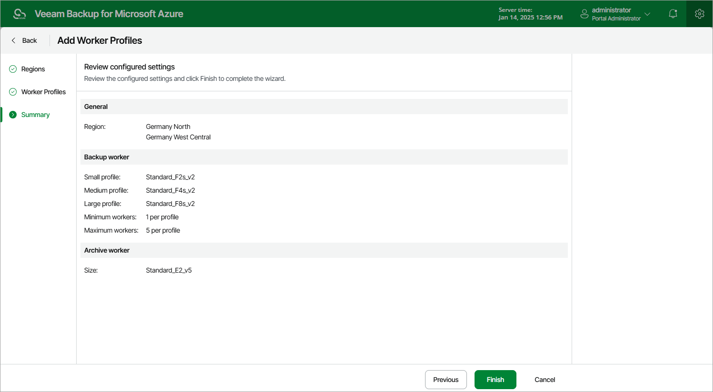

In this article

At the Summary step of the wizard, review summary information and click Finish.

As soon as you click Finish, Veeam Backup for Microsoft Azure will create a separate set of worker profiles for each of the selected regions.

Page updated 11/9/2023

Page content applies to build 8.0.1.202
