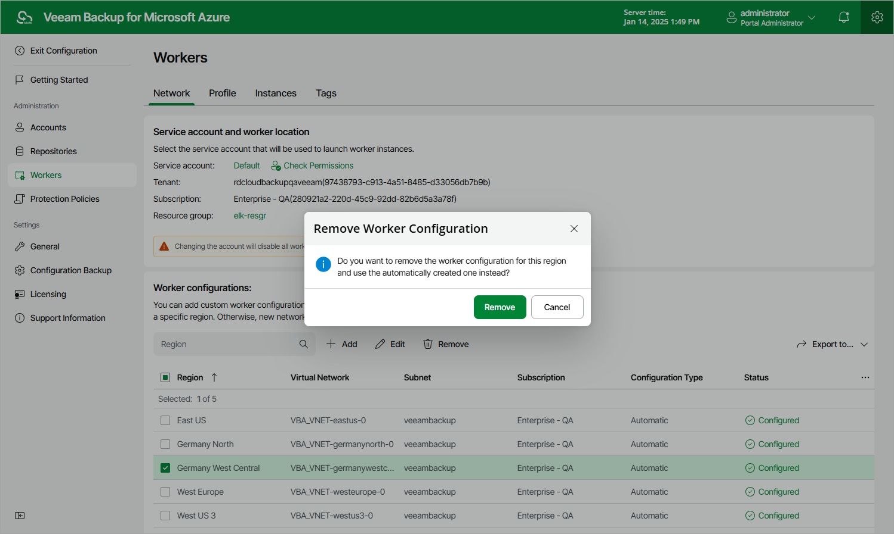

In this article

Veeam Backup for Microsoft Azure allows you to permanently remove sets of worker profiles if you no longer need them.

|  |
| --- |
| Note |
| You cannot remove a profile set if any worker instances that have been created based on this set are currently running. Wait for all the related operations to complete — and then try removing the profile set again. |

To remove a profile set from Veeam Backup for Microsoft Azure, do the following:

1. Switch to the Configuration page.
2. Navigate to Workers > Profile.
3. Select the profile set and click Remove.

Page updated 2/25/2025

Page content applies to build 8.0.1.202
