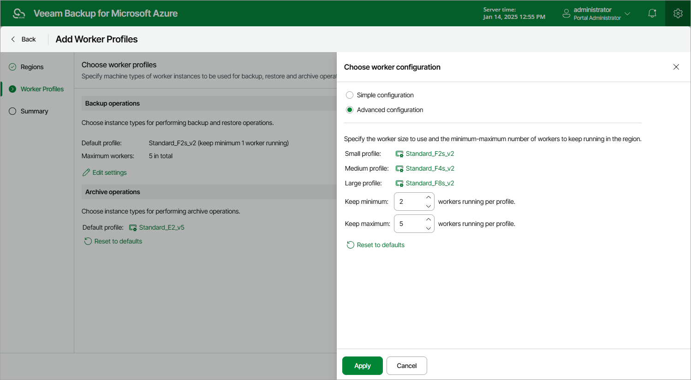

In this article

By default, Veeam Backup for Microsoft Azure launches minimum 1 and maximum 5 worker instances depending on the number of Azure resources processed while performing a backup or restore operation. Each worker instance can process only one Azure resource at a time. If the number of processed resources exceeds the maximum number of worker instances specified in the worker configuration, the resources exceeding this limit are queued.

At the Worker Profiles step of the wizard, you can modify the default number of worker instances to reduce the amount of processing time, and choose profiles that will be used to launch worker instances in the selected regions to boost operational performance.

1. In the Backup operations section, click Edit Settings.
2. In the Choose worker configuration window, do the following:

1. Use the Simple configuration and Advanced configuration options to choose whether you want to use one single VM size for all worker instances that will be launched in the selected regions to perform backup, restore and retention operations, or to specify a small, medium and large profile for the instances.

To help you choose VM sizes, tables in the Select Virtual Machine Size windows will provide information on the number of vCPU cores and the amount of system RAM for each available VM size. For the full description of Azure VM sizes, see [Microsoft Docs](https://docs.microsoft.com/en-us/azure/virtual-machines/sizes-general).

1. In the Minimum workers and Maximum workers fields, specify the minimum and the maximum number of worker instances that Veeam Backup for Microsoft Azure will launch and use simultaneously to process Azure resources in the selected regions during backup and restore operations after you finish working with the wizard.

Consider that both the minimum and the maximum numbers are specified per profile.

|  |
| --- |
| Tip |
| After a backup or restore operation completes, Veeam Backup for Microsoft Azure keeps the minimum number of worker instances running for 10 minutes and then deallocates them; the other instances are automatically removed from the backup infrastructure. To optimize infrastructure costs, set the minimum number of worker instances to 0. |

1. To save changes made to the worker profiles, click Apply.

1. In the Archive operations section, click the link in the Default profile field to specify a VM size for worker instances that will be launched in the selected regions to perform archive operations.

To help you choose the VM size, the table in the Select Virtual Machine Size window will provide information on the number of vCPU cores and the amount of system RAM for each available VM size. For the full description of Azure VM sizes, see [Microsoft Docs](https://docs.microsoft.com/en-us/azure/virtual-machines/sizes-general).

Page updated 9/16/2024

Page content applies to build 8.0.1.202
