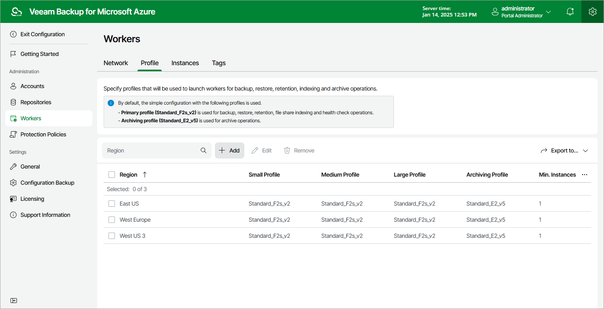

In this article

To launch the Add Worker Profiles wizard, do the following:

1. Switch to the Configuration page.
2. Navigate to Workers > Profile.
3. Click Add.

Page updated 11/9/2023

Page content applies to build 8.0.1.202
