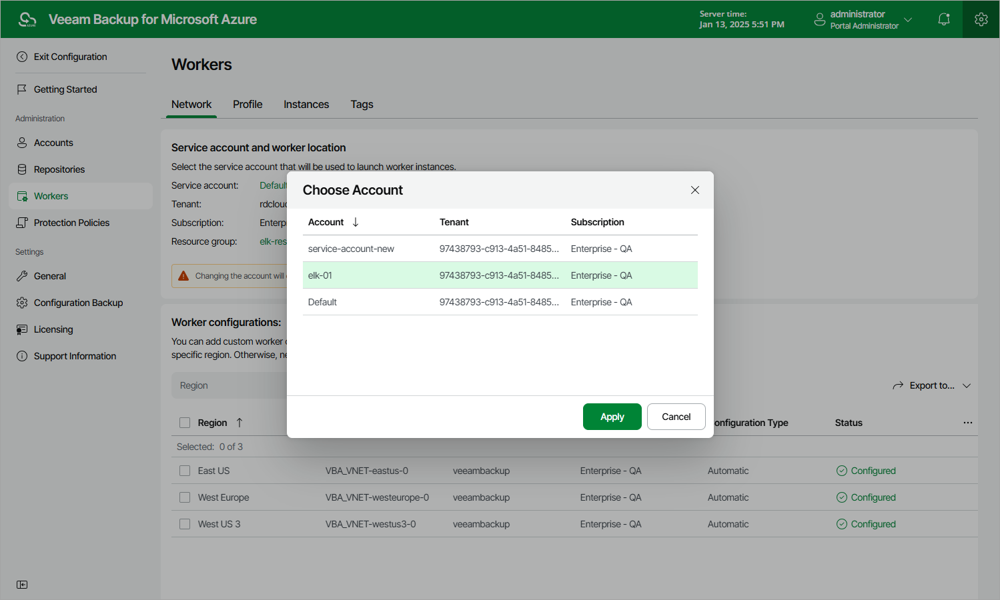

In this article

By default, Veeam Backup for Microsoft Azure launches worker instances in the same Microsoft Entra tenant, Azure subscription and resource group in which the backup appliance is deployed. However, you can specify another destination for the worker instances, as well as a service account that will be used to launch the instances:

1. Switch to the Configuration page.

1. Navigate to Workers > Network.

1. To specify a service account that will be used to launch the worker instances, click the link in the Service account field, and select the necessary destination (a service account, a tenant and a subscription) in the Choose Account window.

For a service account to be displayed in the list of available accounts, it must be added to Veeam Backup for Microsoft Azure and assigned the Worker Management role as described in section [Adding Service Accounts](service_account_add.md).

|  |
| --- |
| Important |
| If your backup appliance operates in a private environment, you cannot specify another tenant for worker instances. |

1. To specify a resource group where the worker instances will be launched, click the link in the Resource group field, and select the necessary group in the Choose Resource Group window.

For a resource group to be displayed in the list of available groups, it must be created in Microsoft Azure as described in [Microsoft Docs](https://docs.microsoft.com/en-us/azure/azure-resource-manager/management/manage-resource-groups-portal) and must belong to the tenant and subscription specified at step 3.

If you change the service account, it is recommended that you check whether the newly selected service account has all the permissions required to launch worker instances. To do that, click Check Permissions and follow the instructions provided in section [Checking Service Account Permissions](service_account_check.md).

|  |
| --- |
| Note |
| If you change the subscription, Veeam Backup for Microsoft Azure will disable all worker configurations created for the previously used subscription — but will not remove them automatically. If you plan to use the worker configurations again, switch back to the previous subscription to allow Veeam Backup for Microsoft Azure to re-enable these configurations. Otherwise, you can remove the configurations manually as described in section [Removing Worker Configurations](worker_configuration_remove.md). |

Page updated 3/21/2025

Page content applies to build 8.0.1.202
